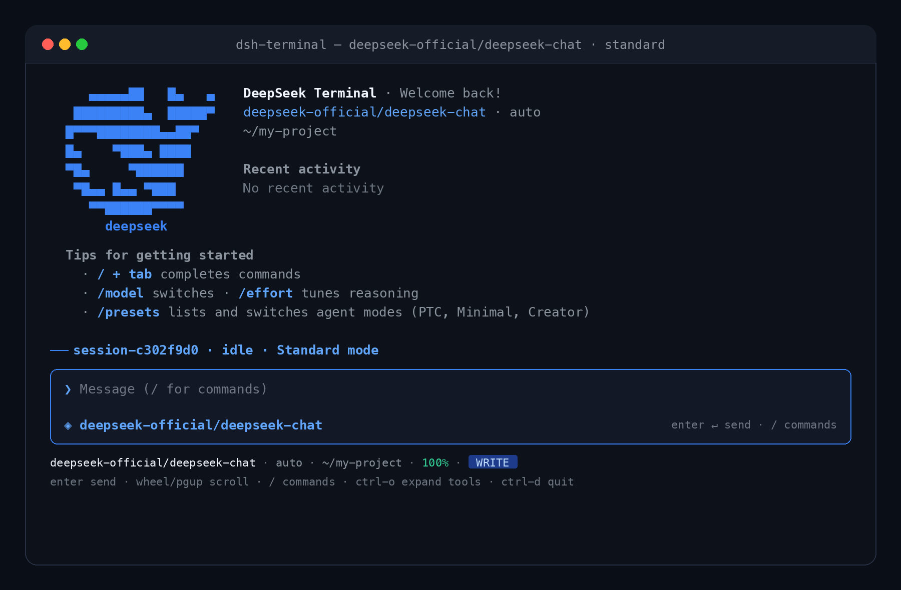
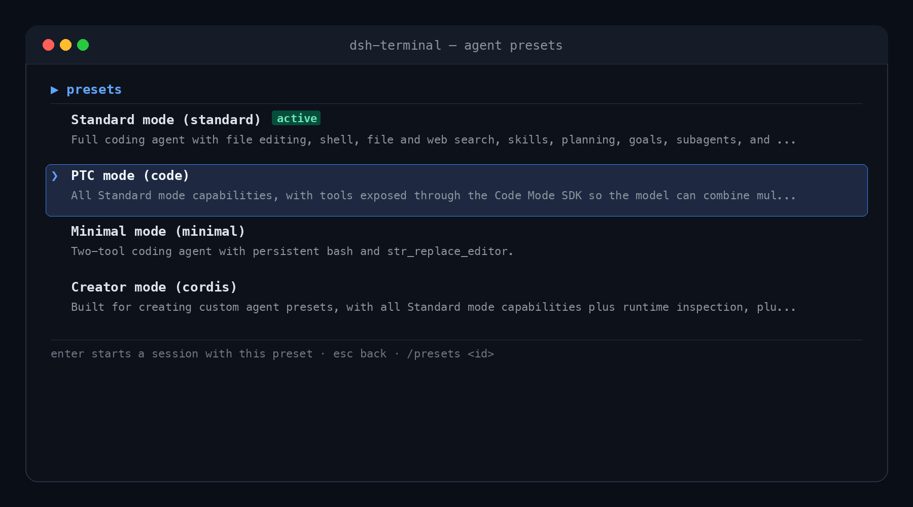

# ⚡ dsh-cli (dsh-terminal)

> **DeepSeek Harness in the terminal** — A Web-GUI-parity Cordis surface over `dsh-base`. Your agents, presets, tools, sessions, approval, settings, and plugins directly in your terminal. Nothing extra, nothing less.

[](LICENSE)
[](https://nodejs.org)
[-0066FF.svg)](https://github.com/rakibulrocky14/dsh-cli)

**[English](README.md) | [简体中文](README_CN.md)**

> [!IMPORTANT]
> **Disclaimer**: This is an independent, community-driven open-source project and is **not affiliated with, endorsed by, or sponsored by DeepSeek AI or the official DeepSeek team**. "DeepSeek" and "DeepSeek Harness" are trademarks of their respective holders.

---






---

## ✨ Features

- 🎨 **DeepSeek Blue Theme & Modern TUI**: Clean rounded composer, branded ASCII whale banner, dynamic status bar, and automatic full-terminal width adaptation.
- 🎛️ **Full Agent Presets Parity**: Switch dynamically between **Standard mode**, **PTC mode** (Code Mode), **Minimal mode**, and **Creator mode** using `/presets`.
- ⚡ **Web-GUI Parity**: Live stream rendering, reasoning effort indicators, tool call cards, session picker, model switchers, and interactive approval modals.
- 🔌 **Seamless Cordis Plugin Support**: Any plugin in your DSH environment automatically works in the terminal.
- 🖱️ **Full Terminal Navigation**: Smooth mouse wheel scrolling, PageUp/PageDown, Tab auto-completion for slash commands, and hotkeys.
- 🧩 **Three Modes at Boot**:
  - **Full-screen TUI**: Default on interactive TTY.
  - **Line REPL**: For pipes, headless environments, CI, or `--line`.
  - **One-shot CLI**: Run a single task via `--print "<task>"` and output the response.

---

## 📦 Installation & Setup

### Prerequisites

- Node.js `^22.19 || >=24`
- [DeepSeek Harness (`dsh`) CLI](https://github.com/deepseek-ai) installed on your system.

### Option 1: Install Directly via DSH CLI (Recommended)

Add this plugin directly to your DSH configuration using `dsh plugin add`:

```bash
# Add to a dedicated 'terminal' profile
dsh plugin --profile terminal add github:rakibulrocky14/dsh-cli
```

### Option 2: Clone and Install Locally

```bash
# 1. Clone the repository
git clone https://github.com/rakibulrocky14/dsh-cli.git
cd dsh-cli

# 2. Install dependencies & build
npm install
npm run build

# 3. Add to DSH profile as a local plugin
dsh plugin --profile terminal add .
```

---

## 🚀 Usage

### Starting the Terminal TUI

Launch the full-screen terminal interface:

```bash
dsh --profile terminal
```

### Command-Line Flags

```bash
# Run with a specific model
dsh --profile terminal --model deepseek-reasoner

# Resume an existing session
dsh --profile terminal --resume session-c302f9d0

# Force standard line REPL (non-TUI)
dsh --profile terminal --line

# One-shot execution (executes task, prints result, and exits)
dsh --profile terminal --print "Explain how to set up a git repository"
```

### Adding More Plugins

Stack additional DSH plugins into your terminal profile:

```bash
dsh plugin --profile terminal add <npm-pkg | github:owner/repo | ./path | ./pkg.tgz>
```

---

## 🎛️ Agent Presets

Open the interactive presets menu anytime with `/presets` or switch directly via `/presets <id>`:

| Preset | ID | Description |
|--------|----|-------------|
| **Standard mode** | `standard` | Full coding agent with file editing, shell execution, search, skills, planning, subagents, and workflows. |
| **PTC mode** | `code` | All Standard mode capabilities with tools exposed via the Code Mode SDK for multi-step TypeScript execution. |
| **Minimal mode** | `minimal` | Ultra-fast two-tool coding agent with persistent bash and `str_replace_editor`. |
| **Creator mode** | `cordis` | Built for authoring and testing custom agent presets with live runtime inspection and plugin tools. |

---

## ⌨️ Shortcuts & Navigation

| Key | Action |
|-----|--------|
| `Enter` | Send message / confirm selection |
| `Esc` | Close active dialog / return to transcript |
| `Tab` | Autocomplete slash commands |
| `↑` / `↓` | Cycle command history or navigate menus |
| `PageUp` / `PageDown` | Scroll transcript up / down |
| `Mouse Wheel` | Smoothly scroll through history and code outputs |
| `Ctrl + O` | Expand / collapse tool output cards |
| `Ctrl + C` | Cancel current turn (or clear prompt when idle) |
| `Ctrl + D` | Exit / quit session |

---

## 🛠️ Slash Commands

Type `/` followed by `Tab` to see all available commands:

- **Sessions**: `/sessions` (interactive session browser), `/resume <id>`, `/new`, `/fork`
- **Configuration**: `/presets` (agent modes), `/model` (provider & model picker), `/effort` (reasoning effort levels), `/settings`, `/permissions`
- **Inspection**: `/tools` (active tool definitions), `/commands` (all registered slash commands), `/skills`, `/agents`, `/plugins`, `/jobs`, `/usage`, `/doctor`
- **Workspace**: `/terminals`, `/todos`, `/title`, `/clear`, `/stop`, `/quit`

---

## 🏗️ Architecture

```
dsh --profile terminal
  └── dsh-terminal (Cordis bundle)
        ├── cordis.patch.yml      base rows + code-runtime + cordis-host + ask-user + startup + runner
        ├── dsh-terminal/startup  command-line flags → terminalStartup
        └── dsh-terminal          runner → TUI | REPL | --print
              ├── core/dsh.ts         service facade & runtime feature detection
              ├── core/transcript.ts  durable-log projection & live streaming overlay
              ├── core/messages.ts    deep-frozen message factories
              ├── core/lineinput.ts   single-reader TTY/pipe input
              ├── repl.ts             line REPL surface
              ├── print.ts            one-shot execution surface
              └── tui/                behavioral engine & Ink React widget tree
```

---

## 🧪 Development & Testing

```bash
# Typecheck
npm run typecheck

# Build TypeScript to lib/
npm run build

# Run comprehensive test suite (61 tests)
npm test
```

---

## 🏷️ Discovery & Tags

`#deepseek` `#deepseek-harness` `#dsh` `#dsh-cli` `#dsh-terminal` `#terminal` `#tui` `#cli` `#ai-agent` `#llm` `#cordis` `#coding-assistant`

---

## 🤝 Contributing

Contributions, bug reports, and pull requests are warmly welcomed! Anyone is welcome to contribute to `dsh-cli`.

- 📖 Check out [CONTRIBUTING.md](CONTRIBUTING.md) for local development setup, testing guidelines, and PR process.
- 💡 Have an idea or found a bug? Feel free to open an issue or pull request anytime!

---

## ⚠️ Disclaimer

`dsh-cli` is an independent, unofficial community project built for the DeepSeek Harness ecosystem. It is **not affiliated with, maintained by, sponsored by, or endorsed by DeepSeek AI or Hangzhou DeepSeek Artificial Intelligence Co., Ltd.**

All product names, logos, brands, and trademarks are property of their respective owners.

---

## 📄 License

[Apache-2.0](LICENSE) © [rakibulrocky14](https://github.com/rakibulrocky14)
